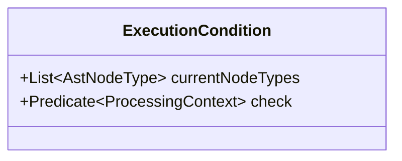

---
aliases:
  - execution condition
---
# Execution Conditions
-> represents the conditions under which a [[Processors|processor]] is executed by the [[Traversers|traverser]]
- every [[Processors|processor]] has exactly one defined execution condition

**There are two levels of checks:**
1. A list of valid AST node types for which the [[Processors|processor]] should be executed
	- used as a fast pre-check by [[Traversers|traversers]]
2. A generic function that may perform more complex checks against the current [[Processing Context|processing context]]

## Implementation
