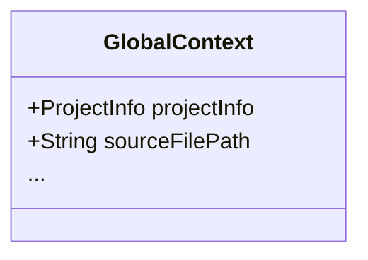

---
aliases:
  - global context
---
# Global Context
-> contains information and data structures that are fixed during the processing of a single source file/AST
- part of the [[Processing Context|processing context]]

**May contain:**
- information about the current project that is processed
- information about the current file (e.g. source file path)
- a reference to the AST root node
- additional object references to [[Native Tools and APIs|native tools]], like language server APIs etc.

## Implementation

- `ProjectInfo` just refers to some generic data class containing information about the currently scanned project, like its root path or project metadata (name, version, etc.)
	- this class may be self-implemented, or provided by [[Native Tools and APIs|external APIs]]
