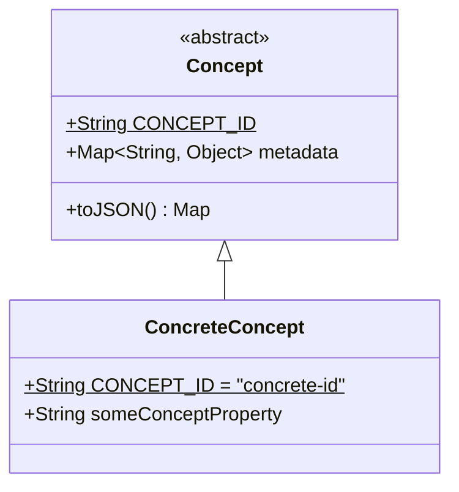

---
aliases:
  - language concept
  - concept
---
# Language Concept
-> a language concept can be any syntactic or semantic programming language construct that may be relevant for the analysis with jQAssistant
- an individual language concept object is usually represented by a single node or connection in the property graph of Neo4j
- concept objects may be nested
- every concept object type has a unique String ID used by [[Concept Map|concept maps]]

**Examples:**
- source code file
- a class declaration
- a method declaration
- a dependency between two classes

## Implementation

- all classes modeling language concepts should inherit from abstract `Concept` class
- `CONCEPT_ID` field of `Concept` class should be static and abstract
- `toJSON()` should contain no processing logic and specifically exclude any values stored under `metadata`
	- as it usually returns all non-`metadata` basic fields per default, it can be provided as a default implementation by the `Concept` base class
	- the return value should be some object or collection that can easily be exported to a JSON file
