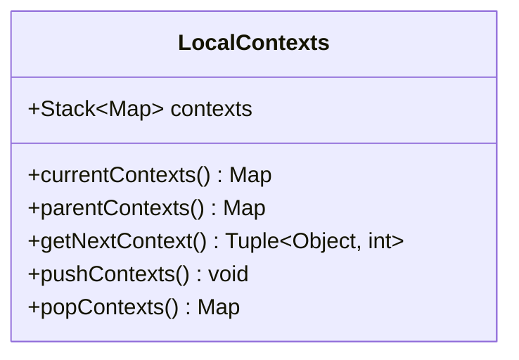

---
aliases:
  - local contexts
---
# Local Contexts
-> stack-based data structure for hierarchically storing generic key-value pair collections used by [[Processors|processors]] on different AST levels
- used to orchestrate extraction processes over multiple [[Processors|processors]] working on different levels of the AST
- the local contexts stack is part of the [[Processing Context|processing context]]

## Implementation

- the maps should use strings or numbers as keys, that are defined as constants in the [[Processors|processor]] class that registers a given context
- map values can be of any type
- the `contexts` field may also have a private visibility to limit the complexity of local context usage
- the methods proposed above serve as guideline for various utility functions that ease the interaction with the local contexts stacks
	- `currentContexts()`: returns a reference to the context map on top of the stack (i.e. for the current level of the AST)
	- `parentContexts()`: returns a reference to the context map on level below the stack top (i.e. for the parent level of the AST)
	- `getNextContext()`: returns the closest-to-stack-top context map value, along with an integer denoting the depth where it was found (`0` for the top of the stack)
	- `pushContexts()`: pushes a new, empty context map on top of the stack
	- `popContexts()`: removes the top context map of the stack and returns it (if possible)