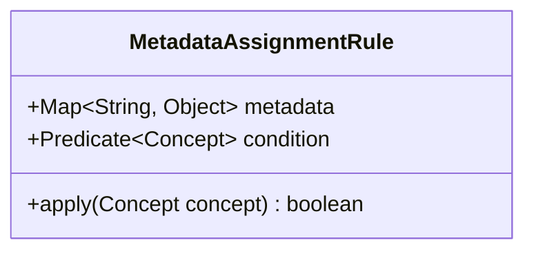

---
aliases:
  - metadata assignment rule
---
# Metadata Assignment Rules
-> rules for attaching certain metadata to [[Language Concept|concepts]] under specific conditions
- a list of active metadata assignment rules is maintained within the [[Processing Context|processing context]]
- rules are applied to [[Language Concept|language concept]] that were extracted in during the [[Processors|postChildrenProcessing phase]]
- the application of a rule is realized as setting one or more key-value pairs in the metadata property of a given [[Language Concept|concept]] object
- each rule contains a condition which has to evaluate to `true` for the rule to be applied
- if a rule was applied to one or more concepts at some point during the AST traversal, it is deleted from the set of active rules
- metadata assignment rules are propagated up the AST by the [[Traversers|traversers]] until it can be applied to at least one concept

## Implementation
