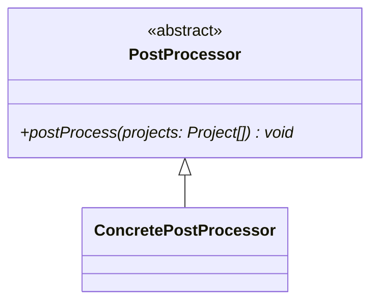

---
aliases:
  - post processor
---
# Post Processors
-> enriches the set of all [[Processors|processor]]-extracted [[Language Concept|concepts]] on a whole-project or even cross-project basis
- can be used to modify existing [[Language Concept|concepts]] or add new ones
- have no access to the AST data, they only work on [[Language Concept|language concept]] objects (which may, however, contain attached metadata by [[Metadata Assignment Rules|metadata assignment rules]])

## Implementation

- the `postProcess` method takes all [[Project|projects]] containing previously extracted [[Language Concept|language concepts]] and modifies them in-place