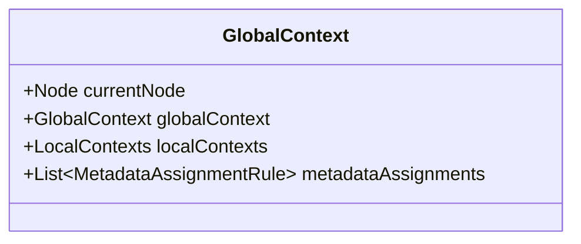

---
aliases:
  - processing context
---
# Processing Context
-> a collection of different data structures that provide every contextual information needed for extracting [[Language Concept|language concepts]] from the scanned source code

**Consists of:**
- information about the current position within the AST (i.e. reference to the current AST node object)
- [[Global Context|global context]] with information about the currently processed project and file along with other references to [[Native Tools and APIs|native APIs]]
- [[Local Contexts|local contexts]] containing data structures shared between different [[Processors|processors]]
- a list of active [[Metadata Assignment Rules|metadata assignment rules]]

## Implementation

- `Node` refers to the type provided by the used [[Native Tools and APIs|AST parser API]]