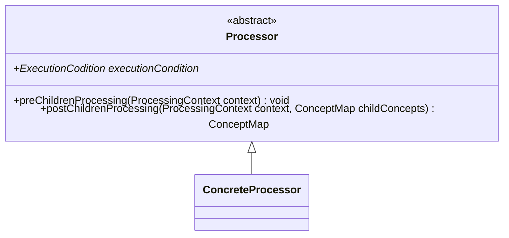

---
aliases:
  - processor
---
# Processors
-> extracts [[Language Concept|language concept]] from a given [[Processing Context|processing context]]
- orchestrated by [[Traversers|traversers]]

**Consists of:**
- an [[Execution Conditions|execution condition]], determining in which concrete context the processor should be executed
- a `preChildrenProcessing` function that can be used to execute logic before the concept extraction for any AST child nodes is attempted
	- usually used to set up [[Local Contexts|local contexts]]
- a `postChildrenProcessing` function that constructs new [[Language Concept|language concept]] objects and returns them as a [[Concept Map|concept map]]
	- receives [[Processing Context|processing context]] and a [[Concept Map|concept map]] containing all previously extracted child [[Language Concept|concepts]] as input
	- when composing more complex [[Language Concept|concept]] object out of child [[Language Concept|concepts]], then these child [[Language Concept|concepts]] should be removed from their [[Concept Map|concept map]]

## Implementation

- empty default implementations should be provided for `preChildrenProcessing` and `postChildrenProcessing`