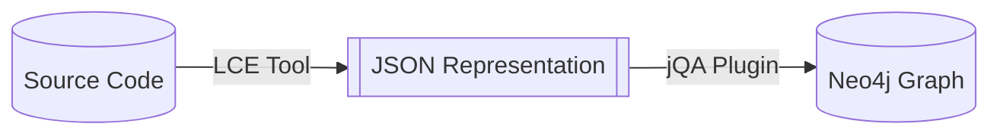

# jQAssistant Language Concept Extractor Architecture

The Language Concept Extractor (LCE) architecture for [jQAssistant](https://jqassistant.org) provides a generic framework for building native [[LCE Tool|tools]] to scan source code of arbitrary programming languages and extract relevant [[Language Concept|language concepts]] from it. It then consolidates the extracted information into an easy-to-process JSON format for a [[jQAssistant Plugin|jQA plugin]].

## Key Goals
- **extensibility**: easily implement the detection and extraction of new language concepts
- **maintainability**: the implementation should be easily adaptable to changes in the programming language
- **up-to-date**: used APIs and libraries need to closely follow release cycles of the analyzed programming language to allow for the fast adoption of new syntax constructs, etc.

## Solution
**Core Idea:**
- split scanning process of source code into two parts:
	1. processing of AST using a natively implemented tool for the programming language, to easily extract/consolidate relevant information
	2. graph generation using the consolidated information from step one by using standard jQA scanner mechanisms
- usage of JSON as an intermediary format as it can easily be processed on most platforms

**Basic Overall Process:**

**Language Concept Extraction Process:** *(performed by the [[LCE Tool]])*
![[lce-process.drawio.png]]
The [[Extractor API]] orchestrates the extraction process to obtain [[Project|project]] objects which are then exported in JSON format. The orchestration process encompasses the following steps:
1. [[Native Tools and APIs|native tools and APIs]] are used to get an enriched, structured view on the source code in the form of ASTs and other data structures
2. [[Traversers|traversers]] traverse the ASTs of all source files and execute different [[Processors|processors]] to extract information on a file-by-file basis
	- the decision whether a [[Processors|processor]] is executed is defined in its [[Execution Conditions|execution condition]]
	- the extracted information is stored in [[Language Concept|language concept]] objects that are organized in [[Concept Map|concept maps]]
	- during the traversal/processing of the AST a [[Processing Context|processing context]] is maintained that can be used to access and/or share all information necessary for processing
	- all available [[Traversers|traversers]]/[[Processors|processors]] are dynamically registered in central [[Feature Collections|feature collections]] (which enables [[Extensions|extensions]])
	- [[Metadata Assignment Rules|metadata assignment rules]] can be used to enrich [[Language Concept|language concept]] objects with additional information that can in-turn be used by other [[Processors|processors]] further up the tree, or by [[Post Processors|post processors]]
	-  all extracted [[Language Concept|language concepts]] are bundled into individual [[Project|project]] objects
3. the [[Project|project]] objects with the extracted [[Language Concept|language concepts]] are re-processed by [[Post Processors|post processors]] on a project-wide/cross-project basis, allowing for advanced resolution algorithms
	- [[Post Processors|post processors]] have no access to the AST data, they only work on [[Language Concept|language concept]] objects (which may, however, contain attached metadata by [[Metadata Assignment Rules|metadata assignment rules]])
4. the processed [[Project|project]] objects are then exported in a JSON format
## Concepts & Mechanisms
- [[Extractor API]] and [[Project|Projects]]
- [[Native Tools and APIs]]
- [[Language Concept]]
	- [[Concept Map]]
- [[Traversers]]
- [[Processors]]
	- [[Processing Context]] ([[Global Context]] & [[Local Contexts]])
	- [[Execution Conditions]]
	- [[Metadata Assignment Rules]]
- [[Post Processors]]
- [[Feature Collections]] and [[Extensions]]

## Projects using the LCE Architecture
- jQA TypeScript Plugin ([Source](https://github.com/jqassistant-plugin/jqassistant-typescript-plugin))
- jQA Dart Plugin ([Source](https://github.com/jqassistant-plugin/jqassistant-dart-plugin), [Docs](https://jqassistant-plugin.github.io/jqassistant-dart-plugin/))